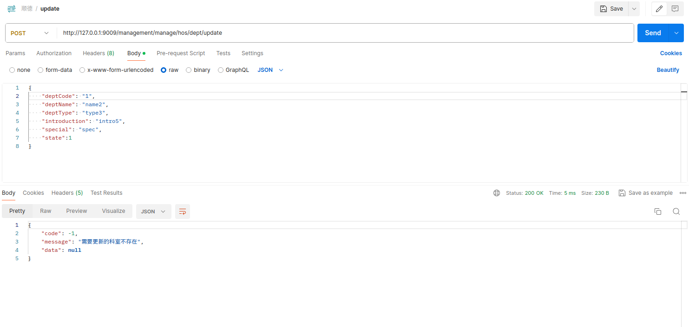

# HSBC HomeWork Project
| purpose                  | Middleware/Framework Library | version |
| ------------------------ | ---------------------------- | ------- |
| java                     | jdk                          | 17      |
| Java scaffolding         | spring-boot                  | 3.1.8   |
| Log                      | log4j2                       | 3.1.8   |
| Cache                    | caffeine                     | 3.1.8   |
| Web Container            | undertow                     | 3.1.8   |
| Memory DB                | h2                           |         |
| Unit Test                | junit                        | 5.9.3   |
| Thread Pool              | ThreadPoolTaskExecutor       |         |
| Project management tools | Maven                        | 3.6.4   |

## Description of Project Architecture

This project adopts a multi-module approach for construction, this approach facilitates modular management and reduces the coupling between project modules

Besides, this project does not rely on external components that require independent installation, such as MySQL/Redis

The project is combined by three big modules:
1) **saas-framework** : used for general tools
2) **saas-management** : used for business logic and project configuration
3) **service-management**: used for launch entry, test code, and use for extending custom content

## Description of specific codes
1) **Bootstrap class**: `cn.swifthealth.starter.ManagementStarter`
2) **Configuration classes**:
   * caffeineCache config:
     `cn.swifthealth.management.configuration.CacheConfig`
   * threadPool config:
     `cn.swifthealth.management.configuration.ThreadPoolTaskConfig`
   * web path config:
     `cn.swifthealth.management.configuration.WebConfiguration`
3) **Incidents operation**:  (including add/query/update/delete)
   `cn.swifthealth.management.manage.hosinfo.controller.DeptController`
   `cn.swifthealth.management.manage.hosinfo.service.DeptService`
4) **Table initial class**:
   `cn.swifthealth.management.manage.hosinfo.service.TableInitService`
5) **Unit and stress test**:
   `test.cn.swifthealth.manage.hosinfo.controller.DeptControllerTests`
   `test.cn.swifthealth.manage.hosinfo.service.DeptServiceTests`
   `scala.cn.swifthealth.manage.hosinfo.DeptInfoApi`
6) **Parameter configuration files**:
   `bootstrap.properties`
   `bootstrap-default.properties`
   `bootstrap-local.properties`
   `bootstrap-test.properties`
   `bootstrap-customize.properties`
7) **Api Exception**:
   `cn.swifthealth.common.jsonRes.APIException`
8) **Json Result**:
   `cn.swifthealth.common.jsonRes.ResponseMessage`

## Interface test cases
1) **Add Incident**
   
   
2) **Query Incident**
   
3) **Update Incident**
   
   
4) **Delete Incident**'
   
   

5) **Unit Test**
   
