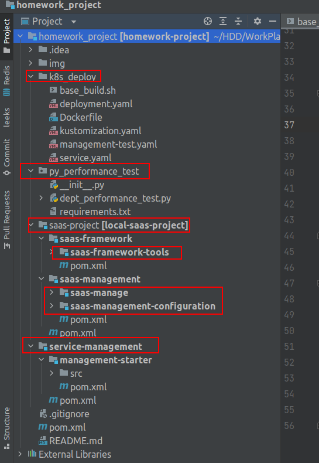
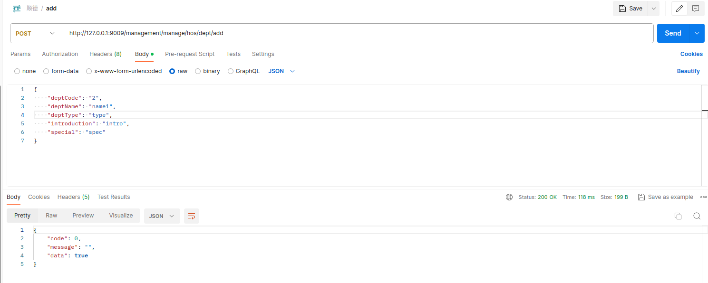
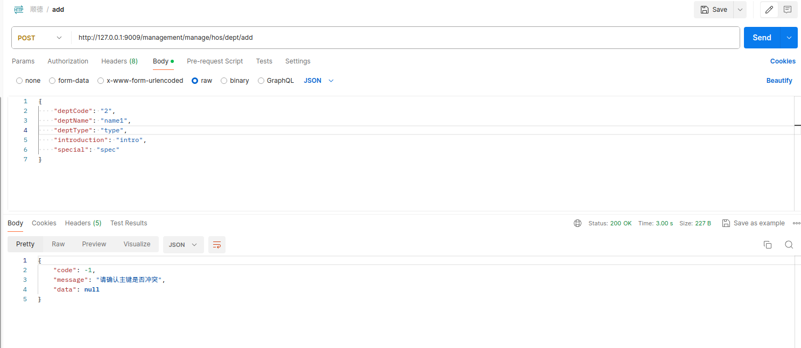
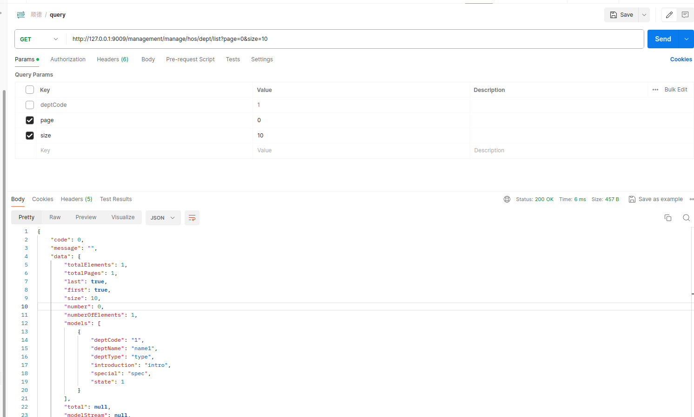
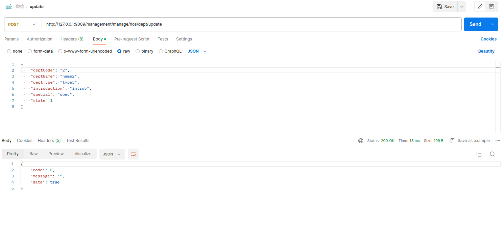
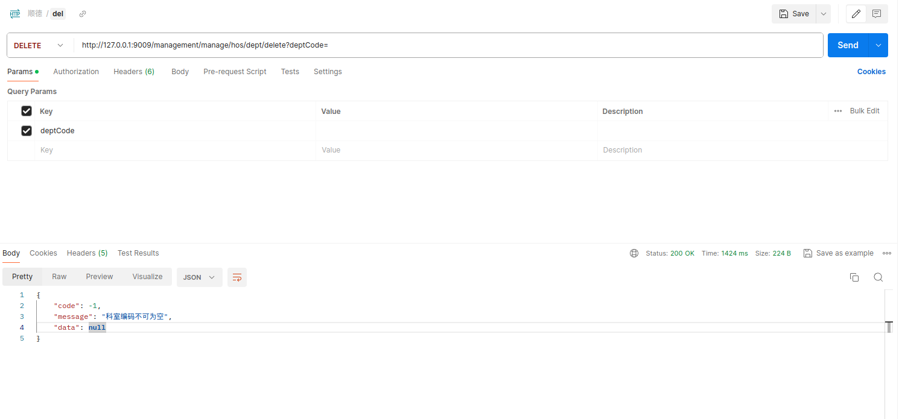
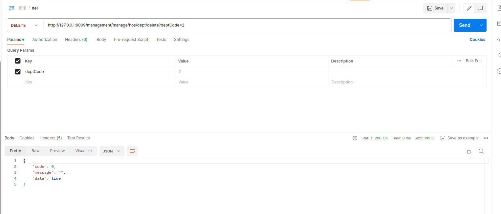
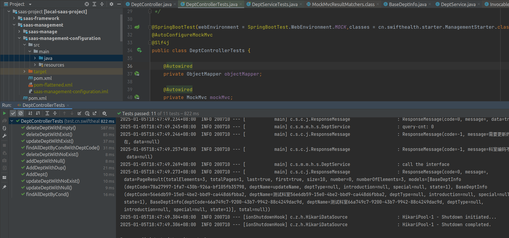
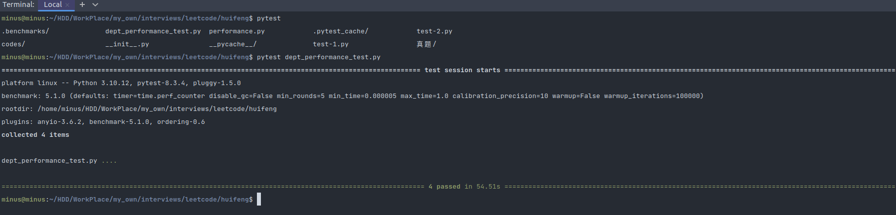
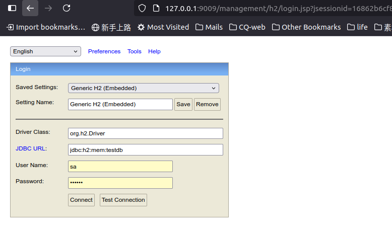

# HSBC HomeWork Project

| Items                    | Middleware/Framework Library | version |
| ------------------------ | ---------------------------- | ------- |
| java                     | jdk                          | 17      |
| Java scaffolding         | spring-boot                  | 3.1.8   |
| Log                      | log4j2                       | 3.1.8   |
| Cache                    | caffeine                     | 3.1.8   |
| Paging tool              | pagehelper                   | 6.1.0   |
| Web Container            | undertow                     | 3.1.8   |
| Memory DB                | h2                           | 2.2.222 |
| Unit Test                | junit                        | 5.9.3   |
| Thread Pool              | ThreadPoolTaskExecutor       |         |
| Project management tools | Maven                        | 3.6.4   |

## Description of Project Architecture

This project adopts a multi-module approach for construction, this approach facilitates modular management and reduces the coupling between project modules

Besides, this project does not rely on external components that require independent installation, such as MySQL/Redis

The project is combined by three big modules:
1) **py_performance_test** : stress test scripts and illustration (python3)
2) **saas-framework** : used for general tools
3) **saas-management** : used for business logic and project configuration
4) **service-management**: used for launch entry, test code, and use for extending custom content

## Description of specific codes
1) **Bootstrap class**: `cn.swifthealth.starter.ManagementStarter`
2) **Configuration classes**:
   * caffeineCache config: 
     `cn.swifthealth.management.configuration.CacheConfig`
   * threadPool config: 
     `cn.swifthealth.management.configuration.ThreadPoolTaskConfig`
   * web path config: 
     `cn.swifthealth.management.configuration.WebConfiguration`
   * object mapper tool config:
      `cn.swifthealth.management.configuration.JacksonConfig`
3) **Incidents operation**:  (including add/query/update/delete)
   `cn.swifthealth.management.manage.hosinfo.controller.DeptController`
   `cn.swifthealth.management.manage.hosinfo.service.DeptService`
4) **Table initial class**:
   `cn.swifthealth.management.manage.hosinfo.service.TableInitService`
5) **Unit and stress test**:
   `test.cn.swifthealth.manage.hosinfo.controller.DeptControllerTests`
   `test.cn.swifthealth.manage.hosinfo.service.DeptServiceTests`
   `scala.cn.swifthealth.manage.hosinfo.DeptInfoApi`
6) **Parameter configuration files**: 
   `bootstrap.properties`
   `bootstrap-default.properties`
   `bootstrap-local.properties`
   `bootstrap-test.properties`
   `bootstrap-customize.properties`
7) **Api Exception**:
   `cn.swifthealth.common.jsonRes.APIException`
8) **Json Result**:
   `cn.swifthealth.common.jsonRes.ResponseMessage`

## How to run
1. **Method one**: run by idea

   Load the entire project into the idea, compile the mvn clean compile successfully, 
   and then start the project by executing Management Starter. java

2. **Method two**: execute jar

   `cd homework_project`

   `mvn clean install`

   `cd service-management/management-starter/target/`

   `java -jar management-starter-1.0.0.jar`

## Interface test cases

**Incident Defination**:  There are many departments in the hospital, and this project mainly involves manipulating departmental information.

1) **Add Incident**

2) **Query Incident**

3) **Update Incident**

4) **Delete Incident**

5) **Unit Test**

6) **Performance:Stress Test**
> stress test script(Python): ./py_performance_test.py

> From the below test picture, we can see that the four interfaces for adding,deleting, 
> modifying and querying of dept are executed in sequence, with each interface executed 10000 times, 
> taking a total of about 55 seconds.

## Others
1) MemDb-H2, web access address: http://127.0.0.1:9009/management/h2
   * username: sa
   * password: 123456
   * jdbc-url: jdbc:h2:mem:testdb

2) Page start from 0 in the pagination parameter of list query

